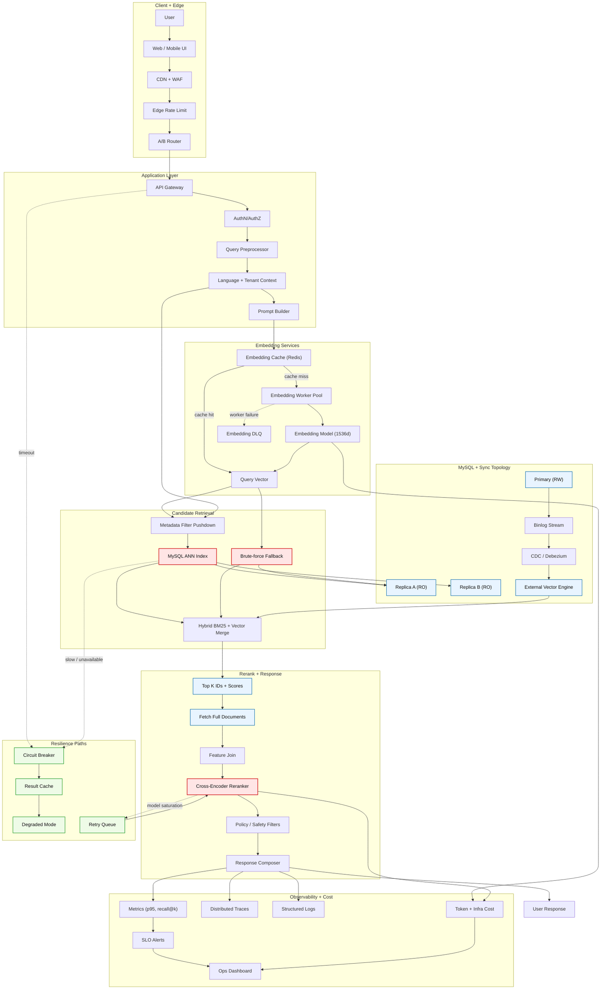

In the ever-evolving landscape of database technology, the integration of vector search capabilities has become a pivotal feature for modern applications. As we move deeper into 2026, the demand for semantic search powered by large language models continues to reshape how we architect data storage layers.

MySQL, often seen as the traditional workhorse of the web, has not been sitting idle. The ecosystem has bifurcated into several interesting paths, each attempting to solve the `k-nearest neighbor` problem without sacrificing the ACID guarantees teams still depend on.

## The Native Approach

Initially, many teams stored vectors as `BLOB` values and performed brute-force scans. While simple, that approach scales linearly with data size and quickly becomes unworkable for latency-sensitive applications.

```sql
CREATE TABLE embeddings (
  id INT PRIMARY KEY AUTO_INCREMENT,
  content TEXT,
  embedding VECTOR(1536)
);

SELECT id,
       content,
       vec_cosine_distance(embedding, @query_vector) AS distance
FROM embeddings
ORDER BY distance ASC
LIMIT 5;
```

The native syntax is clean and integrated. For small-to-mid datasets it can be enough, but once row counts enter eight digits you start feeling the absence of stronger ANN index options. For baseline SQL behavior and engine details, the [MySQL Reference Manual](https://dev.mysql.com/doc/) is still the canonical source.

## Operational Topology

The main architecture decision is where candidate generation runs and where reranking runs. This split tends to dominate latency more than the exact schema.



### Alternative Extensions

A second strategy is to combine MySQL with engines that specialize in high-dimensional search while preserving MySQL as the source of truth.

- PlanetScale Vector for serverless operational simplicity.
- Manticore-style protocol-compatible search engines for high-throughput retrieval.

Both approaches can work if you document ownership of truth, sync lag policy, and failure-mode behavior before launch.
