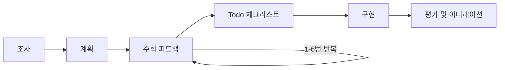
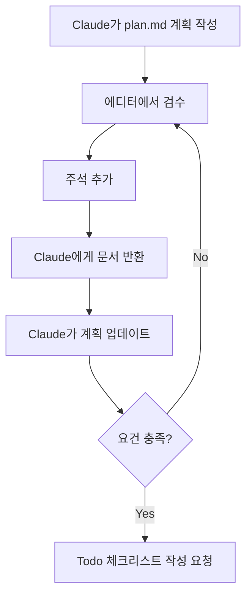
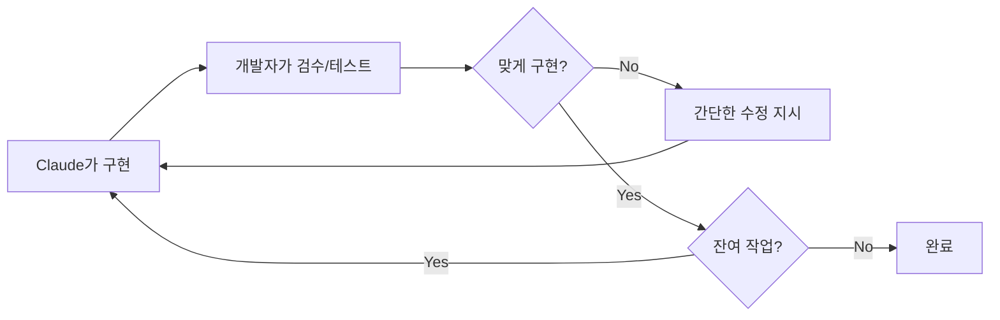
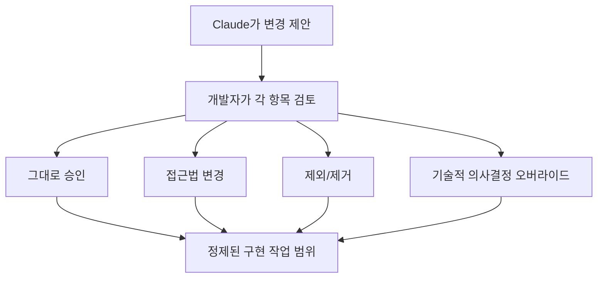

  <ul>
    <li>원글: <a href="https://boristane.com/blog/how-i-use-claude-code/">How I Use Claude Code</a></li>
    <li>Boris Tane은 Cloudflare에서 Workers Observability 팀을 이끌고 있는 소프트웨어 개발자다. 이전에는 Sequoia의 투자를 받은 옵저버빌리티 스타트업 Baselime을 창업했으며, 이후 Cloudflare에 인수되었다.</li>
    <li>옮긴이: Cursor, Antigravity, GSD 등 아래와 같은 워크플로우가 자체적으로 구현되어 있는 경우도 있다. 그러나 변덕스러운 쿼타 정책이나 신규 모델 출시에 따라 앱을 주기적으로 갈아타면서, 자체적으로 운용 가능하도록 배경 원리를 이해하기로 했다. 시행착오를 거듭했던 본인의 워크플로우와 비슷한 점이 많아 인상 깊었다. 모든 앱이 Claude Code처럼 세밀한 컨텍스트 제어가 가능한 건 아니기에 하기 "단일 채팅 세션"에 대해서는 회의적이다.</li>
  </ul>

약 9개월 동안 [Claude Code](https://docs.anthropic.com/en/docs/claude-code)를 주력 개발 도구로 사용해 오면서 나만의 워크플로우에 정착했다. 대다수 사람들이 AI 코딩 도구를 사용하는 방식과는 근본적으로 다르다. 대부분의 개발자는 프롬프트를 입력하고, 가끔 계획(plan) 모드를 쓴 뒤, 에러를 고치고 다시 반복한다. 반면 하드코어 유저들은 Ralph 루프, MCP, 가스타운(역주: Gas Town, 난해한 스팀펑크 용어 체계로 화제되었던 에이전트 하니스) 등을 엮어서 사용한다. 두 경우 모두 조금만 복잡한 작업이 주어지면 여지없이 무너져 내리는 엉망진창인 결과를 낳는다.

앞으로 설명할 워크플로우의 핵심 원칙은 단 하나다. **"문서화된 계획을 리뷰하고 승인하기 전까지는, 절대 Claude가 코드를 작성하지 못하게 할 것."** 계획과 실행의 분리가 핵심이다. 곧바로 코딩에 뛰어드는 방식 대비 최소한의 토큰만 사용하게 된다. 헛수고를 방지하고, 아키텍처를 주도적으로 계획할 수 있으며, 압도적으로 더 나은 결과를 얻을 수 있다.

## 1단계: 리서치

조금이라도 복잡한 모든 작업은 '깊게 읽기(deep-read)' 프롬프트로 시작한다. 무언가를 하기 전에 먼저 코드베이스의 관련 영역을 철저히 이해하도록 Claude에게 요구한다. 그리고 조사한 내용은 단순한 채팅창 요약이 아니라, 반드시 영구적인 마크다운 파일로 작성하도록 강제한다.

> 이 폴더를 깊이 탐색하고, 기능이 어떻게 작동하는지, 무슨 역할을 하는지, 그리고 모든 특이사항을 철저하게 파악해줘. 완료되면 조사한 내용을 상세한 research.md 보고서로 작성해줘.

> 알림 시스템을 매우 상세히 조사하고 내부적으로 세세하게 어떻게 구성되어 있는지 이해하고 나서, 알림 작동 방식에 관해 알아야 할 모든 것을 담은 상세한 research.md 문서를 작성해줘.

> 작업 스케줄링 플로우를 검토하고, 깊게 이해하고 나서 잠재적인 버그를 찾아줘. 취소되어야 할 작업이 실행되는 경우가 있으니 시스템에 분명히 버그가 있어. 모든 버그를 찾을 때까지 플로우를 계속 조사해. 완료되면 발견한 내용으로 상세한 research.md 보고서를 작성해줘.

어휘에 주목해야 한다. **"깊이(deeply)"**, **"매우 상세히(in great details)"**, **"내부적으로 세세하게(intricacies)"**. 단순한 수식어가 아니다. 이런 단어들이 없으면 Claude는 겉핥기식으로 대충 훑어본다. 파일을 읽고, 함수 시그니처 수준에서 무슨 일을 하는지만 파악한 뒤 넘어가 버릴 것이다. 표면적인 분석은 용납하지 않는다는 강력한 신호를 줘야 한다.

결과물로 남는 문서(`research.md`)가 핵심이다. 단순히 Claude에게 숙제를 내주는 것이 아니다. 문서는 작업자 본인에게 '리뷰의 기준점'이 된다. 본격적인 계획을 세우기 전에 문서를 읽어보며 Claude가 시스템을 제대로 이해했는지 검증하고, 오해를 바로잡을 수 있다. 리서치가 틀리면 계획도 잘못되고, 결국 구현도 잘못된다. 쓰레기가 들어가면 쓰레기가 나올 뿐이다(garbage in, garbage out).

이것이 AI 보조 코딩에서 발생하는 가장 값비싼 실패 유형이다. 문법이 틀리거나 로직이 엉망인 것이 문제가 아니다. 개별적으로는 잘 작동하지만 주변 시스템을 망가뜨리는 구현체가 진짜 문제다. 기존 캐싱 시스템을 무시하는 함수, ORM의 컨벤션을 고려하지 않은 마이그레이션, 이미 다른 곳에 존재하는 로직을 중복해서 만드는 API 같은 것들 말이다. 철저한 리서치 단계는 참사를 미연에 방지한다.

## 2단계: 계획 수립

리서치 검토가 끝나면, 별도의 마크다운 파일에 상세한 구현 계획을 작성하라고 지시한다.

> <비즈니스 목표>를 수행하도록 시스템을 확장하는 새로운 기능 <이름 및 설명>을 구축해야 해. 구현 스텝을 담은 상세한 plan.md 문서를 작성해줘. 코드 예시를 포함해줘.

> 목록 API는 offset 대신 cursor 페이지네이션을 지원해야 해. 구현을 위한 상세한 plan.md를 작성해줘. 변경 사항을 제안하기 전에 관련 소스 파일을 읽고, 실제 코드베이스를 바탕으로 계획을 세워줘.
>
> (역주: API 짤 때 "paging"이라고 영어로 그만 쓰자. 메모리 관리와 심지어 '삐삐'라는 의미도 있어서 AI도 헷갈릴 거다.)

생성된 계획서에는 접근 방식에 대한 상세한 설명, 실제 변경 사항을 보여주는 코드 예시, 수정될 파일 경로, 그리고 고려사항과 트레이드오프가 항상 포함된다.

Claude Code에 내장된 플랜(plan) 모드 대신, 직접 만든 `.md` 계획 파일을 사용하려고 한다. 기본으로 제공되는 플랜 모드는 쓸 게 못된다. 마크다운 파일을 사용하면 AI를 보다 세세하게 제어할 수 있다. 에디터에서 직접 수정하고, 주석을 추가할 수 있으며, 프로젝트 내에 실제 산출물로 영속성을 가진다.

**자주 사용하는 팁:** 독립적인 기능에 대해 이미 훌륭하게 구현된 오픈소스가 있다면, 계획 작성을 요청할 때 해당 코드를 레퍼런스로 함께 제공한다. 정렬 가능한 sortable ID를 추가하고 싶다면, 이를 잘 구현한 프로젝트의 ID 생성 코드를 붙여넣고 "정렬 가능한 ID를 만드는 예시야. 비슷한 접근법을 어떻게 채택할 수 있을지 설명하는 plan.md를 작성해줘"라고 지시한다. Claude는 제로 베이스로 설계할 때보다 구체적인 레퍼런스 구현체가 주어졌을 때 극적으로 더 나은 성능을 보여준다.

하지만 계획 문서는 주인공이 아니다. 진짜는 그 다음이다.

## 주석(Annotation) 사이클

본 워크플로우의 특징이다. 인간 개발자로서 가장 큰 가치를 더하는 지점이다.

Claude가 계획을 작성하고 나면, 에디터에서 파일을 열어 **문서에 직접 주석을 추가한다.** 잘못된 가정을 바로잡고, 제안된 접근 방식을 기각하며, 제약 조건을 추가하거나 Claude가 알지 못하는 도메인 지식을 주입한다.

주석의 길이는 천차만별이다. Claude가 선택적(optional)이라고 표시한 매개변수 옆에 "필수임"이라고 한 단어만 적기도 한다. 때로는 비즈니스 제약 사항을 설명하는 문단을 추가하기도 하고, 기대하는 데이터 형태를 보여주기 위해 코드 예제를 통으로 붙여넣기도 한다.

실제로 추가하는 주석은 다음과 같다.

* "마이그레이션에는 raw SQL이 아니라 drizzle:generate 사용 필요" - Claude가 모르는 도메인 지식
* "아님. 이건 PUT이 아니라 PATCH가 되어야 함" - 잘못된 가정 수정
* "항목 전체 삭제 필요. 여기선 캐싱이 필요 없음." - 제안된 접근 방식 기각
* "queue consumer가 이미 retry를 처리하므로, 여기 재시도 로직은 중복임. 삭제하고 그냥 실패하도록 둬야 함." - 변경이 필요한 이유 설명
* "아님. visibility 필드는 개별 항목이 아니라 list 자체에 있어야 함. list가 public이면 모든 항목이 public인 구조임. 맞춰서 스키마 항목 재구성할 필요." - 계획의 특정 구간 전체의 방향성 수정

이후 Claude에게 문서를 넘긴다.

> 문서에 추가한 주석을 모두 확인하고 맞춰서 문서를 업데이트 해줘. 아직 구현은 시작하지 마.

**이 과정을 1회에서 6회 정도 반복한다.** 명시적으로 **"아직 구현하지 말 것"**이라고 쉴드를 쳐야 한다. 아니면 Claude는 계획이 충분하다고 생각하는 순간 곧바로 코딩으로 넘어가 버린다. 개발자가 만족할 때까지, 계획은 결코 충분하지 않다.

### 왜 효과가 좋은가?

마크다운 파일은 인간과 Claude 사이의 **공유 가변 상태(shared mutable state)** 역할을 한다. 각자의 속도에 맞춰 고민하고, 잘못된 내용을 주석으로 정확히 짚어내며, 컨텍스트를 잃지 않고 작업을 재개할 수 있다. 채팅 메시지로 모든 것을 장황하게 설명할 필요가 없다. 그저 문서에서 문제가 있는 정확한 위치를 짚고, 수정 사항을 적어 넣으면 된다.

채팅 메시지로 구현 방향을 이끌어가는 것과는 근본적으로 다르다. 계획 문서는 구조화되어 있고, 전체적인 맥락에서 리뷰할 수 있는 완전한 명세서다. 반면 채팅 대화는 의사결정 과정을 재구성하기 위해 계속 스크롤을 올려가며 찾아봐야 하는 파편화된 기록일 뿐이다. 계획 문서의 압승이다.

"메모를 추가했으니 계획을 업데이트하라"는 과정을 세 번 정도 거치면, 평범했던 구현 계획이 기존 시스템에 완벽하게 들어맞는 맞춤형 계획으로 탈바꿈한다. Claude는 코드를 이해하고, 해결책을 제안하며, 구현체를 작성하는 데 탁월하다. 하지만 프로덕트 우선순위, 사용자의 페인포인트, 혹은 조직에서 기꺼이 감수하고자 하는 엔지니어링 트레이드오프가 무엇인지는 모른다. 주석 사이클은 바로 이러한 '인간의 판단력'을 주입하는 과정이다.

### Todo 체크리스트

구현을 시작하기 전, 항상 작업을 잘게 쪼개달라고 요청한다.

> 계획 문서에 세부적인 Todo 체크리스트를 추가해줘. 계획을 완료하는 데 필요한 모든 단계와 개별 작업을 포함하고, 아직 구현은 하지마.

이렇게 구현 과정에서 진행 상황을 추적할 수 있는 체크리스트가 만들어진다. Claude가 작업을 진행하며 완료된 항목을 표시하기 때문에, 언제든 계획 문서로 현재 상황을 정확히 파악할 수 있다. 몇 시간씩 이어지는 긴 작업 세션에서 특히 진가를 발휘한다.

## 3단계: 구현

계획이 준비되면 드디어 구현 명령을 내린다. 아래 프롬프트는 여러 세션에 걸쳐 다듬어 낸, 일종의 표준 템플릿이다.

> 문서의 내용을 전부 구현해줘. 특정 작업이나 단계를 완료하면 계획 문서에 완료로 표시해줘. 모든 작업과 단계가 완료될 때까지 멈추지 말고 진행해. 불필요한 주석이나 jsdoc을 추가하지 말고, any 또는 알 수 없는 타입(unknown types)을 사용하지 마. 지속적으로 타입 체크(typecheck)를 실행하여 새로운 문제가 발생하지 않는지 확인해줘.

이 단일 프롬프트에는 중요한 모든 지침이 암호처럼 압축되어 있다.

* "<u>전부 구현</u>": 입맛대로 체리피킹하지 말고 계획된 모든 것을 수행하라는 의미.
* "<u>계획 문서에 완료로 표시</u>": 진행 상황을 추적할 수 있는 단일 진실 공급원(SSOT)은 계획 문서임을 강조.
* "<u>모든 작업이 완료될 때까지 멈추지 말고 진행</u>": 흐름 중간에 승인을 받으려고 멈추지 말라는 지시.
* "<u>불필요한 주석이나 jsdoc 추가 금지</u>": 코드를 간결하게 유지하기 위함.
* "<u>any 또는 알 수 없는 타입 사용 금지</u>": 엄격한 타입 안정성 유지.
* "<u>지속적인 타입 체크</u>": 마지막이 아닌 초기 단계에서 문제를 포착하라는 뜻.

대부분의 경우에 (약간의 변형만 거쳐) 이 문구를 똑같이 사용한다. "전부 구현할 것"이라고 말하는 시점에는 이미 모든 의사결정과 검증이 끝난 상태다. 구현은 창의적인 작업이 아니라 기계적인 작업이 된다. 철저히 의도된 바다. **구현 과정은 지루해야만 한다.** 창의적인 고민은 주석 피드백 단계에서 모두 끝났다. 계획이 올바르게 세워졌다면, 실행 자체는 간단해야 한다.

계획 단계가 없다면 보통 Claude가 초반에 '그럴싸하지만 잘못된' 가정을 세우고, 잘못된 기반에 15분 동안 코드를 쌓아 올리는 대참사가 발생한다. 결국 얽히고설킨 변경 사항들을 일일이 풀어내야만 한다. "아직 구현하지 말 것"이라는 가이드는 이런 사태를 방지한다.

## 구현 중 피드백

Claude가 계획을 실행하기 시작하면, 인간의 역할은 '아키텍트'에서 '감독관'으로 전환된다. 프롬프트도 훨씬 짧아진다.

계획 단계의 메모가 문단 단위였다면, 구현 중의 수정 피드백은 대체로 단일 문장이다.

* "`deduplicateByTitle` 함수를 구현 안 했어."
* "어드민 앱에 있어야 할 설정 페이지를 메인 앱에 만들었어. 옮겨."

Claude는 계획의 전체 컨텍스트와 진행 중인 세션의 흐름을 모두 꿰고 있기 때문에, 이렇게 짧고 간단한 지시로도 충분하다.

프론트엔드 작업은 가장 반복이 많은 구간이다. 브라우저에서 직접 테스트하며 빠른 템포로 수정 지시를 쏟아낸다.

* "더 넓게"
* "여전히 잘려"
* "2px 정도 간격이 있어"

시각적인 문제는 스크린샷을 첨부하기도 한다. 어긋난 테이블의 모습을 말로 설명하기보다는 스크린샷 한 장을 보여주는 것이 훨씬 빠르다.

기존 코드를 레퍼런스로 던져주는 일도 끊임없이 반복한다.
* "이 테이블은 기존의 사용자 테이블과 완전히 똑같이 보여야 해. 같은 헤더, 같은 페이지네이션, 같은 행 밀도(row density)를 사용해야 해."

처음부터 디자인을 구구절절 설명하는 것보다 훨씬 정교한 방식이다. 성숙한 코드베이스에서 대부분의 기능은 기존 패턴의 변형에 불과하다. 새로운 설정 페이지는 마땅히 기존 설정 페이지들과 비슷해 보여야 한다. 레퍼런스를 짚어주면 일일이 나열하지 않아도 암묵적인 요구사항이 모두 전달된다. Claude 역시 수정에 들어가기 전에 해당 레퍼런스 파일을 알아서 읽어볼 것이다.

무언가 잘못된 방향으로 흘러갈 때, 어설프게 덧대어 고치려 하지 않는다. 차라리 git 변경 사항을 과감히 버리고, 롤백한 뒤 작업 범위(scope)를 다시 설정한다.
* "전부 revert 했어. 리스트 뷰를 더 미니멀하게 만들기만 하면 돼. 다른 건 건드리지 마."

롤백 후 범위를 좁히는 것이, 이미 잘못된 상황을 이터레이션으로 고쳐보려는 시도보다 거의 항상 더 나은 결과를 낳는다.

## 주도권 유지하기 (운전대 놓지 않기)

실행을 Claude에게 위임하더라도, **무엇을 구축할지에 대한 전적인 자율성은 절대 넘겨주지 않는다.** 적극적인 방향성 설정의 대부분은 `plan.md` 문서 내에서 인간이 직접 수행한다.

생각보다 중요한 차이다. 종종 Claude는 기술적으로는 맞지만 해당 프로젝트에는 어울리지 않는 해결책을 제안하기 때문이다. 오버 엔지니어링된 접근법이거나, 시스템의 다른 영역이 의존하고 있는 공개 API 시그니처를 마음대로 바꿔버리거나, 더 단순한 방법이 있는데도 복잡한 옵션을 선택하곤 한다. 시스템의 전반적인 컨텍스트, 프로덕트 방향성, 그리고 조직의 엔지니어링 문화에 대한 맥락은 오직 인간만이 알고 있다.

* <u>제안 사항 체리픽:</u> Claude가 여러 이슈를 짚어낼 때, 하나씩 살펴보며 판단을 내린다. "첫 번째는 그냥 Promise.all을 쓰고 너무 복잡하게 만들지 마. 세 번째는 가독성을 위해 별도 함수로 추출해줘. 네 번째와 다섯 번째는 복잡성을 감수할 가치가 없으니 무시해." - 지금 무엇이 중요한지에 대한 지식을 바탕으로 개별 항목마다 결정을 내리는 것이다.

* <u>작업 범위 축소:</u> 계획에 '있으면 좋은(nice-to-have)' 기능이 포함되어 있다면 적극적으로 쳐낸다. "계획에서 다운로드 기능은 빼줘. 아직 구현할 필요 없어." - 이렇게 요구사항이 은근슬쩍 부풀어 오르는 작업 범위 크리프(scope creep)을 막는다.

* <u>기존 인터페이스 보호:</u> 절대 변경되어서는 안 되는 기존 코드가 있다면 엄격한 제약 조건을 설정한다. "이 세 함수의 시그니처는 변경하면 안돼. 라이브러리가 아니라 호출자가 맞춰서 수정되어야 해."

* <u>기술적 의사결정 오버라이드:</u> Claude는 모르게 본인이 명확하게 선호하는 기술이 있을 수 있다. "저 모델 대신 이 모델을 쓸 것" 또는 "커스텀 메서드를 작성하지 말고 이 라이브러리의 내장 메서드를 써"처럼 빠르고 직접적으로 개입한다.

기계적인 작업은 Claude가 맡고, 판단은 인간이 내린다. 굵직한 결정사항들은 계획 문서에 미리 담아두고, 구현 도중 발생하는 자잘한 문제들은 선별적인 지시를 통해 해결해 나간다.

## 단일 채팅 세션 (하나의 긴 대화 유지하기)

리서치, 계획 수립, 구현 과정을 여러 세션으로 쪼개지 않고 **하나의 긴 세션**에서 진행한다. 폴더 깊게 읽기로 시작해, 세 차례의 주석 사이클을 거치고, 전체 구현을 실행하는 이 모든 과정이 끊김 없는 단 하나의 대화창에서 이루어진다.

항간에 떠도는 "컨텍스트 윈도우가 50%를 넘어가면 성능이 저하된다"는 현상은 체감할 수 없었다. (옮긴이: 제미나이로는 바로 경험해 볼 수 있다.) 오히려 "전부 구현하라"고 지시할 즈음이면, Claude는 이미 세션 내내 시스템에 대한 이해도를 극한으로 끌어올린 상태다. 리서치 단계에서 파일을 읽고, 주석 사이클을 돌며 코드베이스를 개념화 하고, 인간이 주입한 도메인 지식과 수정 사항을 완벽히 흡수했기 때문이다.

컨텍스트 윈도우가 꽉 차더라도, Claude의 자동 압축(auto-compaction) 기능 덕분에 작업을 이어가기에 충분한 맥락이 유지된다. 게다가 영구적인 결과물인 계획 문서 자체는 훼손 없이 온전히 살아남으므로, 언제든 Claude에게 해당 문서를 다시 참조하라고 지시할 수 있다.

## 한 줄로 요약하는 워크플로우

코드를 깊이 읽히고, 계획을 작성하게 한 뒤, 완벽해질 때까지 주석을 달며 다듬고, 마침내 멈춤 없이 전체를 구현하게 한다. 그 과정에서 지속적으로 타입 체크와 같은 검수를 한다.

이게 전부다. 마법 같은 프롬프트도, 복잡한 시스템 인스트럭션도, 기발한 꼼수도 필요 없다. 그저 '생각하는 과정'과 '코딩하는 과정'을 분리하는 규율 잡힌 파이프라인이 있을 뿐이다. 리서치는 무지에서 비롯된 변경을 막고, 계획은 잘못된 방향으로 새는 것을 방지한다. 주석 사이클은 인간의 판단력을 주입하는 과정이며, 마지막 구현 명령은 모든 결정이 내려진 후 방해 없이 코드가 작성되게끔 달리는 길이다.

이 워크플로우를 한 번 시도해 보길 바란다. 인간과 코드 사이에 '주석이 달린 계획 문서'를 두지 않고서, 대체 그동안 어떻게 AI 코딩 에이전트들로 결과물을 배포해 올 수 있었는지 의아해질 것이다.
